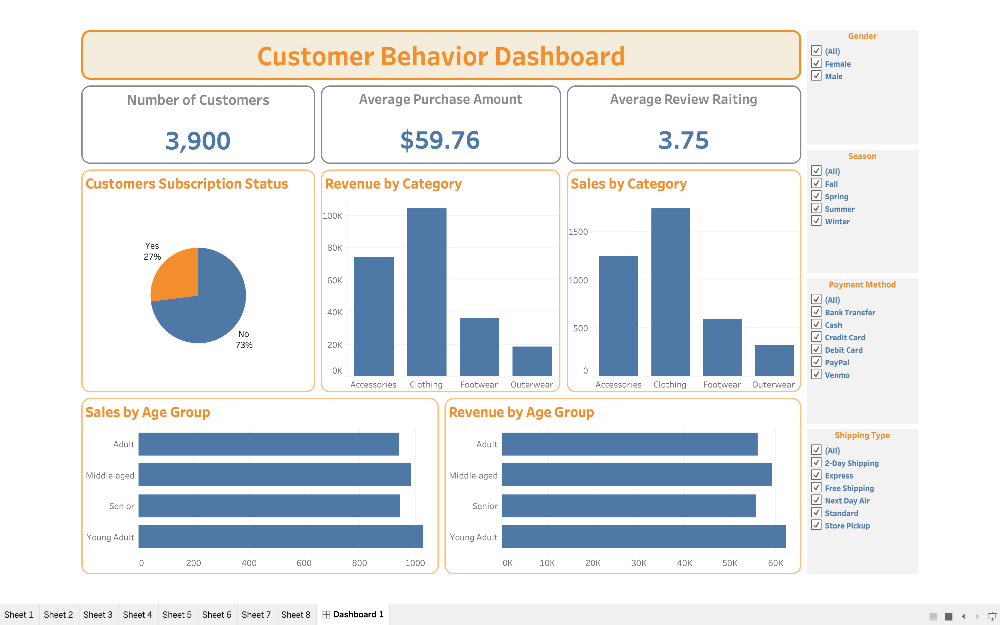

# Customer Shopping Behavior Analytics 📊🛒

This repository contains a comprehensive data analytics project focused on analyzing customer shopping behavior to uncover key insights, trends, and actionable business recommendations. Utilizing Python, SQL, and Tableau, the project explores demographic performance, purchasing habits, and satisfaction metrics to optimize marketing strategies and maximize customer retention.

---

## 🚀 Project Overview
In today's competitive retail landscape, understanding consumer behavior is vital. This project performs an end-to-end data analysis workflow—from raw data cleaning and exploratory data analysis (EDA) to advanced data visualization and dashboard creation. 

The primary goals are:
*   Identify high-value customer segments based on spending habits and demographics (Age, Gender, Location).
*   Analyze purchasing patterns across different seasons, categories, and payment methods.
*   Evaluate the impact of promotional discounts and loyalty programs on overall sales.
*   Deliver interactive dashboards for business stakeholders to make data-driven decisions.

---

## 🛠️ Tech Stack & Tools
*   **Data Analysis:** Python (`Pandas`, `NumPy`)
*   **Data Visualization:** Tableau
*   **Database Management:** MySQL / SQL
*   **Environment:** Jupyter Notebook / VS Code

---

  

## 📈 Key Insights & Findings
*   **Demographics:** The highest spending bracket belongs to customers aged 25-45, with a balanced distribution across genders.
*   **Seasonality:** A significant spike in sales is observed during the Fall and Winter seasons, particularly within the 'Clothing' and 'Accessories' categories.
*   **Promotions:** While promotional discounts increase the total order volume, the average order value (AOV) remains stable, suggesting customers bundle lower-priced items when discounts are active.
*   **Payment & Shipping:** Credit Card and PayPal are the preferred payment methods, and offering 'Free Shipping' shows a strong correlation with higher customer satisfaction scores.
